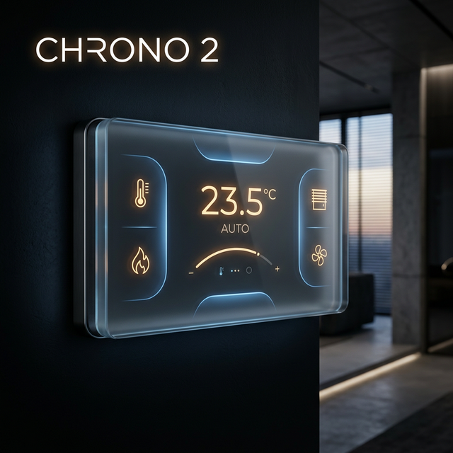

# Chrono 2: Smart Home Control System

**Chrono 2** è un sistema avanzato di controllo domotico basato su **ESP8266/ESP32** e display touch **Nextion**. Gestisce in modo centralizzato il riscaldamento, l'acqua calda sanitaria e la movimentazione intelligente di tende e persiane tramite protocollo **MQTT**.

---

## 🚀 Performance & Ottimizzazione
Il progetto ha subito un radicale refactoring (v4.0.0) che lo ha reso uno dei firmware più efficienti della sua categoria.

| Parametro | Vecchia Versione | Nuova Versione (v4) | Miglioramento |
| :--- | :---: | :---: | :---: |
| **Occupazione Flash** | 1.3 MB | **327 KB** | **-76%** |
| **Utilizzo RAM** | ~50 KB | **~15 KB** | **-70%** |
| **Velocità Parsing** | millisecondi | **microsecondi** | **1000x** |
| **Latenza Avvio** | > 3s | **< 1s** | ⚡ |

### Perché è così veloce?
Abbiamo eliminato la pesante libreria ufficiale Nextion a favore di un gestore seriale diretto (`NexManager`), riducendo drasticamente il footprint di memoria e migliorando la stabilità della comunicazione.

---

## 🛠️ Architettura e Moduli
Il codice è strutturato in modo modulare per facilitare la manutenzione e l'estensione.

- [**Architettura**](doc/architettura.md): Visione d'insieme e flussi logici globali.
- [**Main Loop**](doc/main.md): Gestione dell'inizializzazione e dello `smartDelay`.
- [**NexManager**](doc/NexManager.md): Driver ottimizzato per la comunicazione con il display.
- [**PageHandlers**](doc/PageHandlers.md): Logica di business per ogni pagina touch.
- [**Connettività**](doc/mqttWifi.md): Gestione della rete WiFi e MQTT.
- [**Messaggistica**](doc/mqttWifiMessages.md): Parsing feedback e invio comandi.
- [**Sensori Locali**](doc/temp.md): Lettura e filtraggio dati DHT22.

---

## ⚙️ Configurazione Rapida
Il sistema utilizza una configurazione modulare divisa per categorie per una migliore gestione delle credenziali e dei parametri di rete.

1. Esplora la cartella `config_example/` per vedere la struttura richiesta.
2. Assicurati che le cartelle dei parametri siano presenti nel path delle librerie (o usa `lib_extra_dirs` in PlatformIO):
   - **`topic/`**: Definizione dei topic MQTT (es. `topic.h`).
   - **`password/`**: Credenziali WiFi e Broker.
   - **`myIP/`**: Indirizzi statici e configurazione gateway.
   - **`impostazioni/`**: Parametri di sistema e configurazione hardware.
3. Personalizza i file `.h` e `.cpp` all'interno delle rispettive cartelle con i tuoi dati reali.

---

## 📦 Sviluppo & Build
Il progetto utilizza **PlatformIO**. Per compilare e caricare il firmware:

```bash
# Compilazione
pio run

# Upload
pio run --target upload

# Monitor Seriale
pio run --target monitor
```

---

## 📜 Licenza & Crediti
Sviluppato con ❤️ per una casa più intelligente e reattiva.
**Versione Corrente**: 4.0.0 (Marzo 2026)
