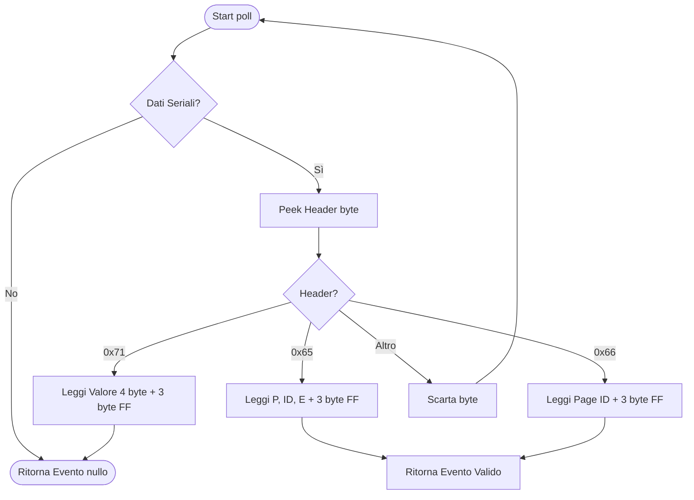
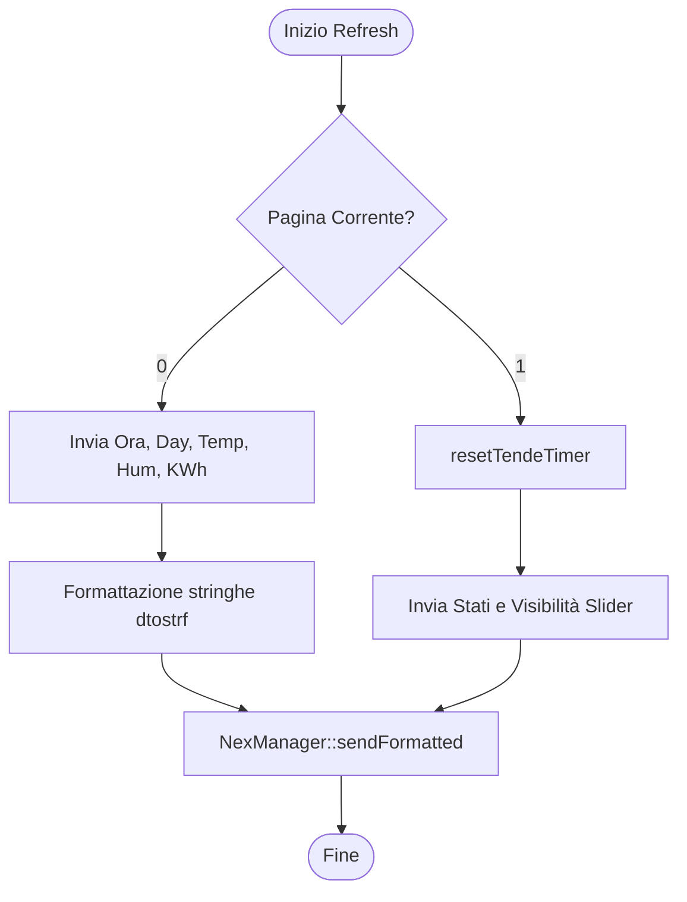

# 📺 NexManager: Gestore Display
[← Torna al README](../README.md)

Il modulo `NexManager` astrae la comunicazione seriale con il display Nextion. È stato progettato per sostituire la libreria ufficiale, risparmiando oltre l'80% della memoria Flash.

## Parsing degli Eventi (poll)

## Aggiornamento Grafica (refreshCurrentPage)

