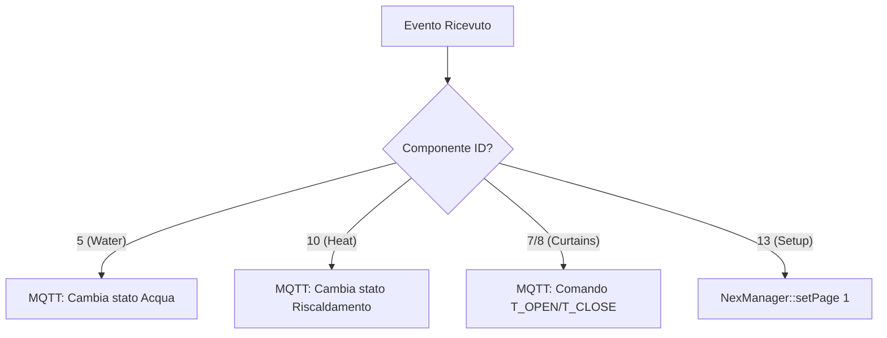
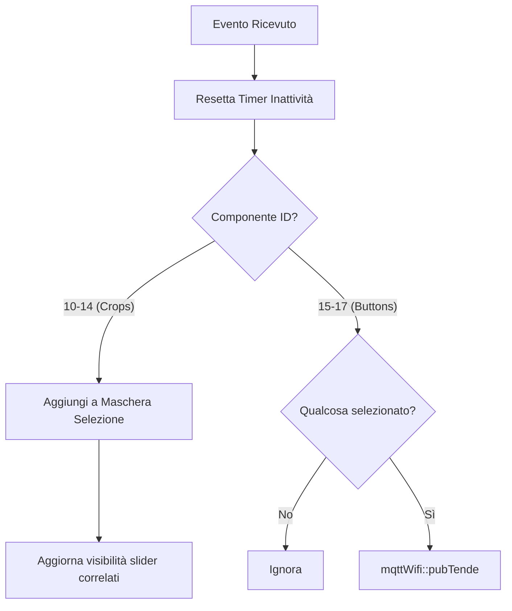
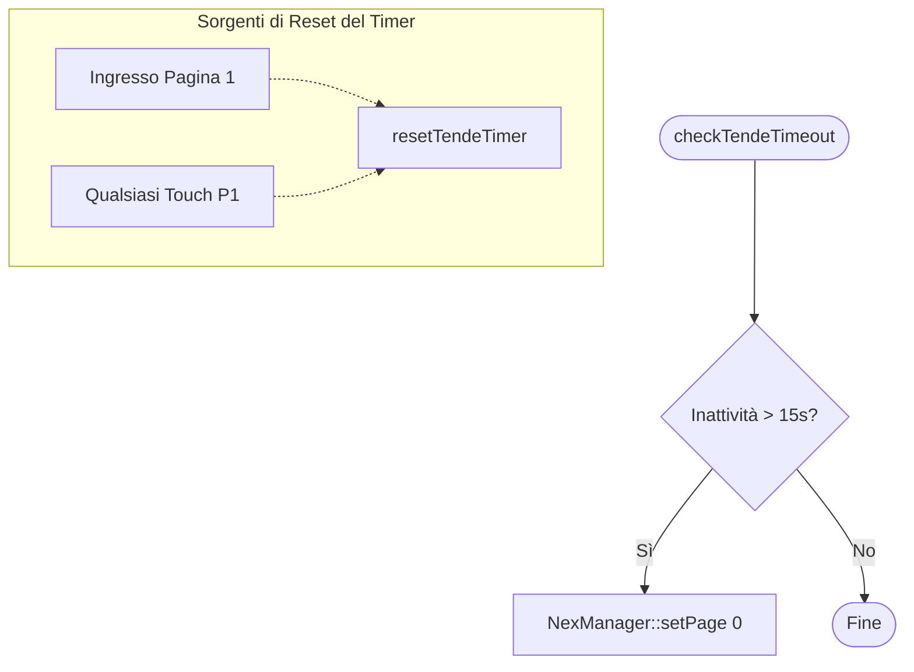

# 🖱️ PageHandlers: Logica Interfaccia
[← Torna al README](../README.md)

Questo modulo contiene la logica di business che risponde agli eventi touch. Separa la gestione degli eventi dalla comunicazione di basso livello.

## Gestione Pagina Home (handleHomePage)

## Gestione Pagina Tende (handleTendePage)

## Timeout Tende (checkTendeTimeout)

