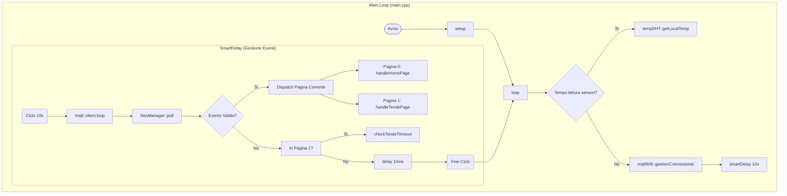
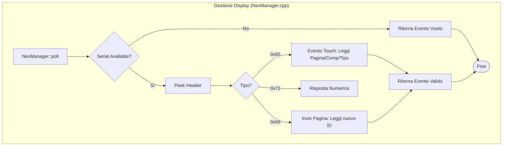
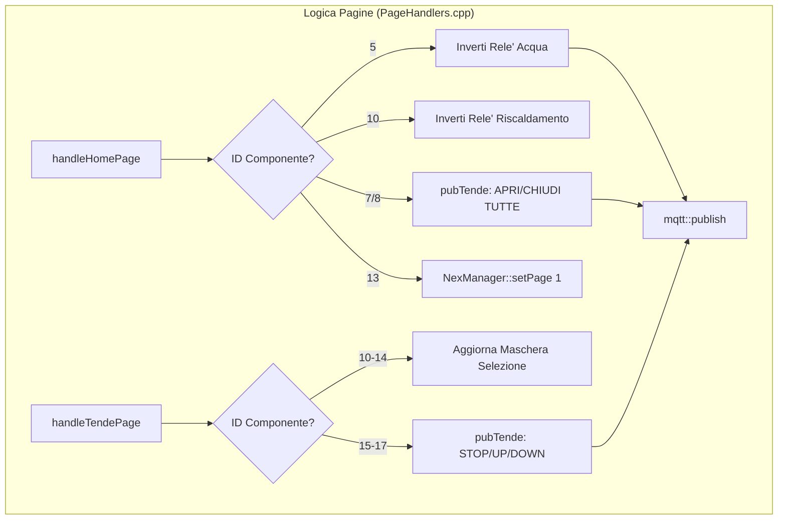
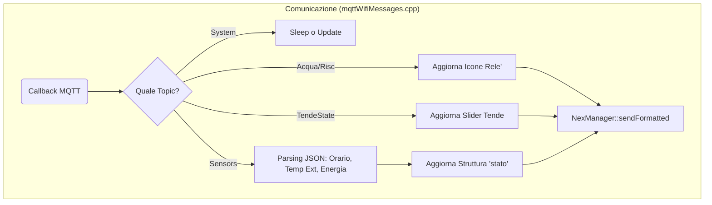
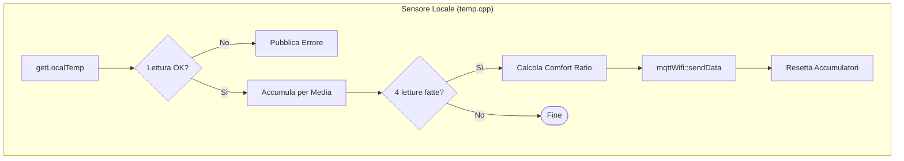

# Documentazione Progetto Chrono

In questo documento è descritta l'architettura del firmware e il flusso logico tra i principali moduli.

## 1. Visione d'Insieme (Main Loop)
Il file `main.cpp` gestisce il ciclo di vita principale. Utilizza la funzione `smartDelay` per garantire che il sistema non si blocchi mai durante le attese, permettendo al client MQTT di elaborare i messaggi e al display di rispondere ai tocchi.

## 2. Gestione Display (NexManager)
`NexManager.cpp` astrae la comunicazione seriale con il pannello Nextion. Trasforma i byte grezzi in eventi strutturati.

## 3. Logica delle Pagine (PageHandlers)
`PageHandlers.cpp` contiene la logica di business associata agli elementi grafici.

## 4. Ricezione Dati e Callback (mqttWifiMessages)
Questo modulo gestisce l'arrivo dei dati dall'esterno (MQTT) e l'aggiornamento dello stato globale e della grafica.

## 5. Lettura Sensore Locale (temp.cpp)
Implementa la lettura del DHT22 con una logica di media mobile per maggiore stabilità.

