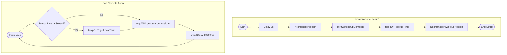
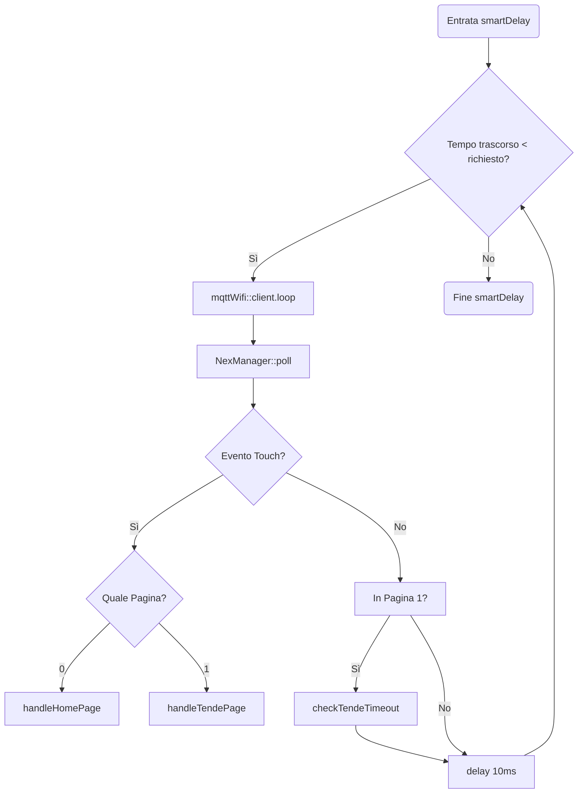

# 🔄 Main Loop & Inizializzazione
[← Torna al README](../README.md)

Il file `main.cpp` è il cuore dell'applicazione. Gestisce il setup del sistema e il ciclo di esecuzione principale garantendo reattività tramite task asincroni.

## Diagramma di Flusso Principale

## Funzione smartDelay
Questa funzione è critica poiché permette l'esecuzione di task in background (MQTT e Touch) durante le attese.

