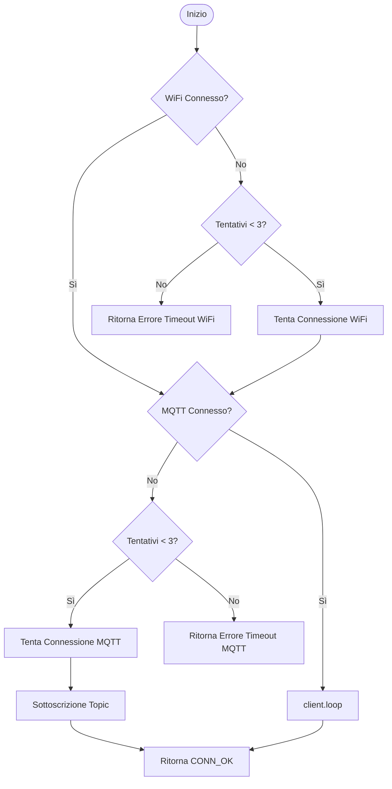
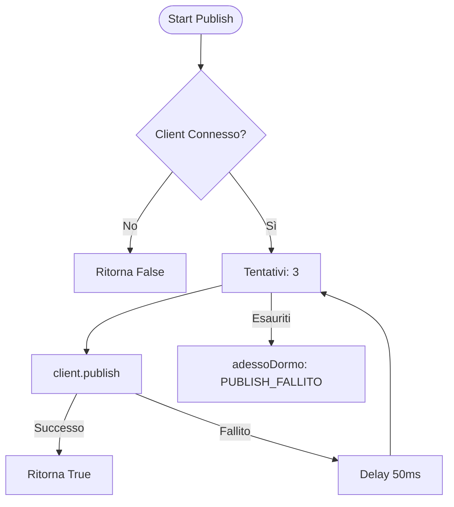

# 🌐 Connettività WiFi & MQTT
[← Torna al README](../README.md)

Gestisce la resilienza della connessione di rete e il protocollo di comunicazione con il broker. Implementa logiche di riconnessione automatica e queuing dei messaggi.

## Gestione Connessioni (gestisciConnessione)

## Pubblicazione con Retry (publish)

