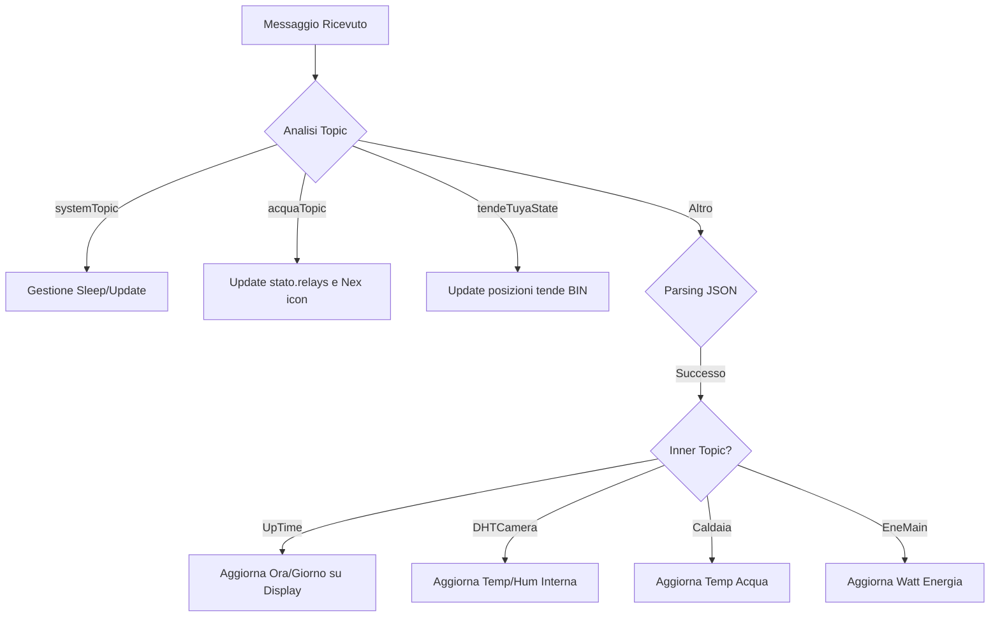
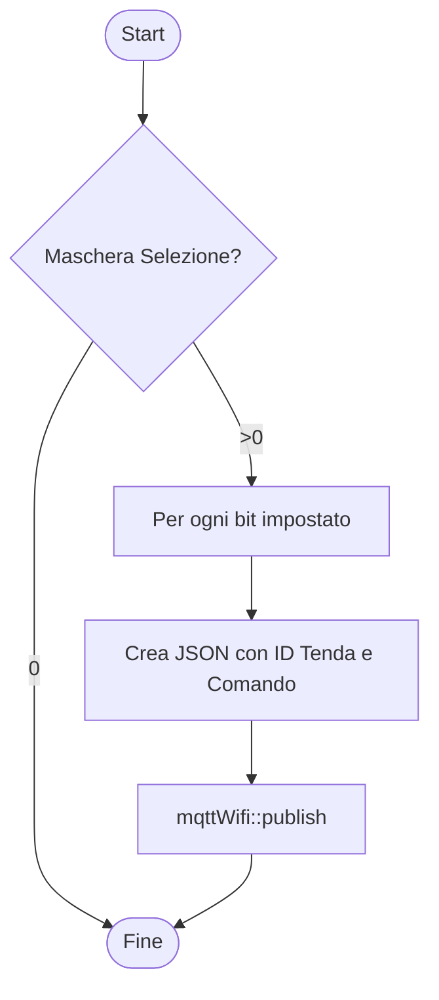

# ✉️ Gestione Messaggi MQTT
[← Torna al README](../README.md)

Questo modulo gestisce il parsing dei messaggi in ingresso e la formattazione dei dati in uscita, agendo da ponte tra il cloud/HUB e l'interfaccia fisica.

## Callback di Ricezione (callback)

## Invio Posizioni Tende (pubTende)

