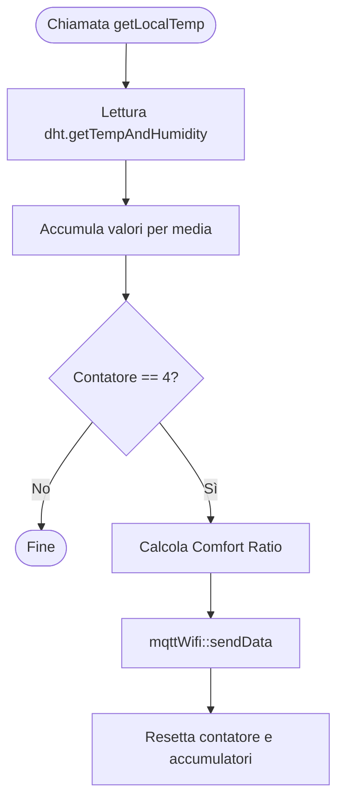
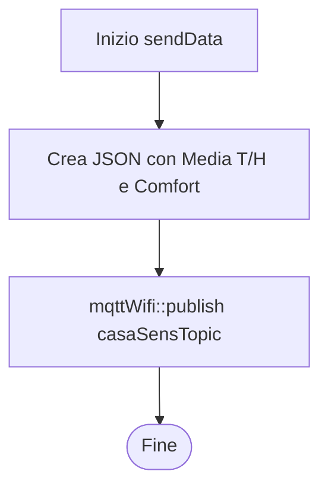

# Gestione Temperatura: temp.cpp

Gestisce la lettura locale del sensore DHT22.

## Logica di Lettura (getLocalTemp)

## Invio Dati (sendData)
Avviene in `mqttWifiMessages.cpp` ma è chiamata da `temp.cpp`.

